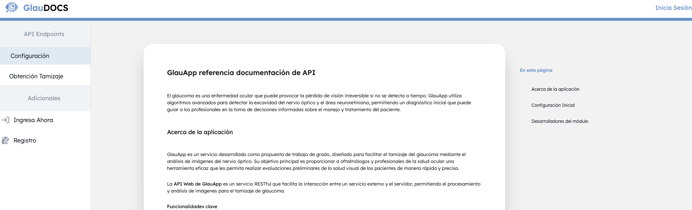

# GluApp Documentation

Este proyecto está desarrollado en [Next.js](https://nextjs.org) con TypeScript, Flowbite, Tailwind CSS y Axios, utilizando GitHub Actions para la integración continua. Este trabajo de grado fue realizado por los siguientes autores:

- **Fabio Luis Buitrago Ochoa**
- **Luisa Lorena Parra Nivia**
- **Felipe García Castiblanco**
- **Erick Santiago Garavito Villamil**

## Descripción

La documentación de GluApp proporciona una interfaz de usuario clara y detallada para acceder a las funcionalidades de la Web API. La aplicación permite gestionar diversos aspectos de la API, como autenticación, configuración y obtención de tokens. A continuación, se describen las pantallas y funcionalidades principales de la aplicación:

### Interfaz de Usuario – Web API

Esta sección detalla las interfaces de usuario de la Web API, describiendo los componentes visuales, las interacciones y los mensajes de confirmación o error para cada pantalla.

### Interfaces

#### Pantalla Principal

La pantalla principal muestra la información relacionada con la API Web, incluyendo detalles sobre el desarrollo y las personas involucradas en la implementación del sistema. También incluye un menú de navegación que facilita el acceso a diferentes secciones, como configuraciones y endpoints.

- **Entradas**: No posee entradas.
- **Salidas**: No posee salidas.

#### Pantalla Configuración

Esta sección muestra cómo enviar solicitudes POST con encabezados de autenticación y tipo de contenido para obtener análisis de imágenes. Se incluyen datos como la URL de la imagen en la solicitud.

- **Entradas**: No posee entradas.
- **Salidas**: No posee salidas.

#### Pantalla de Inicio de Sesión

Permite a los usuarios acceder a la plataforma ingresando su correo electrónico y contraseña. Los mensajes de error se muestran si las credenciales son incorrectas, o se redirige al usuario a contenido autorizado si el acceso es exitoso.

- **Entradas**: Correo electrónico, contraseña.
- **Salidas**: Mensajes de error o redirección a contenido autorizado.

#### Pantalla de Registro

Permite a los usuarios registrarse en la plataforma proporcionando datos básicos, como correo electrónico, nombre, entidad y contraseña.

- **Entradas**: Correo electrónico, nombre, entidad, contraseña.
- **Salidas**: Mensajes de error o redirección a contenido autorizado.

#### Pantalla de Token

Los usuarios pueden solicitar un token que se utilizará en solicitudes posteriores. También tienen la opción de cancelar el token cuando ya no se necesite.

- **Entradas**: Solicitud de token mediante un botón.
- **Salidas**: Resultado de la solicitud del token y su estado (ACTIVO | INACTIVO | PENDING).

#### Menú

El menú permite la navegación entre las diferentes pantallas de la aplicación, como el inicio de sesión, registro, configuración y obtención de tamizajes.

- **Entradas**: No se reciben entradas directas del usuario en esta interfaz, solo interacciones mediante botones de acción.
- **Salidas**:
  - **Ingresar ahora**: Inicia el proceso de inicio de sesión.
  - **Registro**: Inicia el proceso de registro.
  - **Configuración**: Inicia el proceso de configuración y visualización.
  - **Obtención Tamizaje**: Inicia el proceso para visualizar el servicio.

#### Cerrar Sesión

La interfaz de cerrar sesión permite al usuario desconectarse de la plataforma.

- **Entradas**: No se reciben entradas directas.
- **Salidas**: Cierre de sesión.

### Diagrama de Navegación

El diagrama de navegación ilustra el flujo de la aplicación desde el registro de usuario hasta el acceso y uso de las funcionalidades de la API.

## Instalación

Para comenzar con el desarrollo, sigue estos pasos:

1. Clona el repositorio:

   ```bash
   git clone https://github.com/usuario/gluapp-docs.git
   cd gluapp-docs
   ```

2. Instala las dependencias:

   ```bash
   npm install
   # o
   yarn install
   # o
   pnpm install
   ```

3. Inicia el servidor de desarrollo:

   ```bash
   npm run dev
   # o
   yarn dev
   # o
   pnpm dev
   # o
   bun dev
   ```

4. Abre [http://localhost:3000](http://localhost:3000) en tu navegador para ver la aplicación en funcionamiento.

## Tecnologías Utilizadas

- **Next.js**: Framework de React para crear aplicaciones web.
- **TypeScript**: Lenguaje que añade tipado estático a JavaScript.
- **Flowbite**: Biblioteca de componentes UI basada en Tailwind CSS.
- **Tailwind CSS**: Framework de utilidades para crear diseños personalizados rápidamente.
- **Axios**: Cliente HTTP para realizar solicitudes a la API.
- **GitHub Actions**: Herramienta de integración continua para la automatización del flujo de trabajo de desarrollo.

## Despliegue

Puedes ver la aplicación desplegada en el siguiente enlace: [https://glauappdocs.lat](https://glauappdocs.lat).

## Contribuir

Si deseas contribuir al proyecto, puedes hacer un fork del repositorio y enviar tus pull requests. Todos los comentarios y sugerencias son bienvenidos.

---

Este proyecto fue desarrollado como parte del trabajo de grado por Fabio Luis Buitrago Ochoa, Luisa Lorena Parra Nivia, Felipe García Castiblanco y Erick Santiago Garavito Villamil.